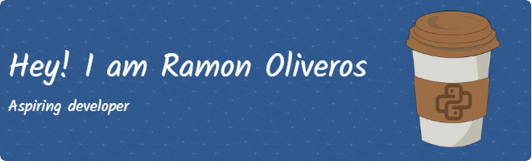

# Hello, everyone! 

🌱 "Curioso por naturaleza y amante de la tecnología. Aprendiendo Python a través de pequeños proyectos, ¡es muy divertido!"

## Las estadisticas del repositorio

<!---
Monradev/Monradev is a ✨ special ✨ repository because its `README.md` (this file) appears on your GitHub profile.
You can click the Preview link to take a look at your changes.
--->
